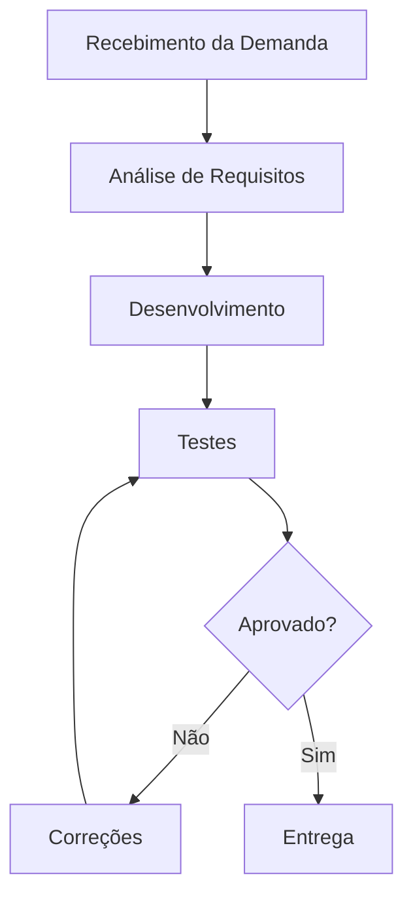

# Aula 14 - Qualidade de Processo

## 1. Mapeamento do Processo

### Fluxo do Processo

### Descrição do Processo

* **Recebimento da Demanda**: A equipe recebe uma nova funcionalidade ou correção.
* **Análise de Requisitos**: Entendimento do que precisa ser desenvolvido.
* **Desenvolvimento**: Implementação da funcionalidade.
* **Testes**: Validação manual e/ou automatizada.
* **Correções**: Ajustes caso sejam encontrados erros.
* **Entrega**: Disponibilização da funcionalidade pronta.

---

## 2. Tabela de Entradas, Atividades e Saídas

| Etapa                  | Entrada              | Atividade                  | Saída                   |
| ---------------------- | -------------------- | -------------------------- | ----------------------- |
| Recebimento da Demanda | Solicitação / Issue  | Registro da demanda        | Demanda documentada     |
| Análise de Requisitos  | Demanda documentada  | Levantamento de requisitos | Requisitos definidos    |
| Desenvolvimento        | Requisitos definidos | Codificação                | Código implementado     |
| Testes                 | Código implementado  | Execução de testes         | Relatório de testes     |
| Correções              | Falhas identificadas | Ajustes no código          | Código corrigido        |
| Entrega                | Código validado      | Deploy / entrega           | Funcionalidade entregue |

---

## 3. Reflexão sobre o Processo

### 1. O processo está claramente definido?

Parcialmente. Algumas etapas são conhecidas, mas não estão formalmente documentadas, o que pode gerar inconsistências.

---

### 2. Todos seguem o mesmo fluxo?

Não necessariamente. Pode haver variação entre integrantes, causando desalinhamento.

---

### 3. Onde a qualidade é verificada?

Principalmente em:

* Testes
* Correções

Mas deveria estar presente desde a análise até o desenvolvimento.

---

### 4. Melhorias sugeridas

* Padronizar o processo
* Documentar o fluxo
* Implementar CI/CD
* Automatizar testes
* Fazer code review

---

### 5. Impacto na qualidade do produto

Um bom processo reduz erros, retrabalho e melhora a organização, resultando em um software mais confiável e de melhor qualidade.

